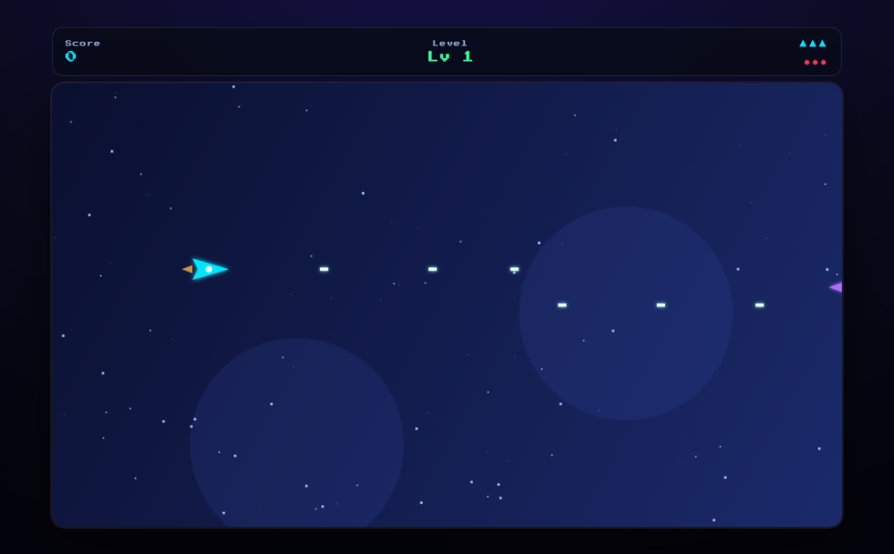

# Space-Jam 🚀👾

> A horizontal side-scrolling space shooter — blast through 10 themed sectors of enemy fleets and bosses, grab weapon upgrades, and top the online leaderboard.

[](https://danmat.github.io/Space-Jam/)
&nbsp;


<p align="center">
  
</p>

## What is it?

The original Space-Jam was built on the Akihabara game engine. This is a
ground-up rebuild in **dependency-free vanilla JavaScript** on a plain canvas —
same idea (you on the left, enemies from the right), but with modern shmup
trimmings: enemy movement patterns and formations, weapon upgrades, bosses,
combos, and an online leaderboard. All art is drawn procedurally (no image
assets).

## Features

- 🚀 **10 themed sectors**, each ending in a **boss** with a health bar.
- 🛸 **Enemy variety & patterns** — scouts, sine-weavers, divers, kamikazes, gunships and armored turrets, plus **formations**.
- 🔫 **Weapon upgrades** — the `W` power-up widens your spread (up to 5-way); `H` adds **homing missiles**.
- 🧰 **Power-ups** — `R` rapid fire, `S` shield, `B` smart bomb, `L` extra life.
- 💥 **Smart bombs** — clear the screen of bullets and hurt everything.
- 🔥 **Combo multiplier** for kill streaks.
- 🏆 **Online leaderboard** with retro 3-initial entry (localStorage fallback).
- 🕹️ Keyboard + mouse/touch, fully responsive.

## Controls

| Action | Input |
| --- | --- |
| Move | WASD · Arrow keys · Mouse / touch |
| Fire | Automatic |
| Smart bomb | <kbd>B</kbd> or click |
| Pause | <kbd>P</kbd> or <kbd>Esc</kbd> |

## High scores

The leaderboard uses your browser's **localStorage** out of the box and shares
an online board across all of these games via a free **Supabase** project. See
[`docs/supabase.sql`](docs/supabase.sql) for the schema and
[`js/config.js`](js/config.js) for where the project URL + public key go — the
board is namespaced by `gameId`, so Space-Jam's scores are separate.

## Play locally

It's a static site — no build step:

```bash
git clone https://github.com/DanMat/Space-Jam.git
cd Space-Jam
python3 -m http.server 8000   # then visit http://localhost:8000
```

## How it works

| File | Responsibility |
| --- | --- |
| `js/game.js` | Canvas engine: player, enemy AI/patterns, bullets, missiles, bosses, power-ups, HUD, state machine. |
| `js/levels.js` | Pure-data level definitions (theme, enemy mix, boss). |
| `js/leaderboard.js` | Reusable high-score store (Supabase REST + localStorage fallback). |
| `js/config.js` | Supabase URL/key and game id. |

## Credits

Rebuilt in vanilla JavaScript from the original Akihabara-engine version.

## License

[MIT](LICENSE) © DanMat
